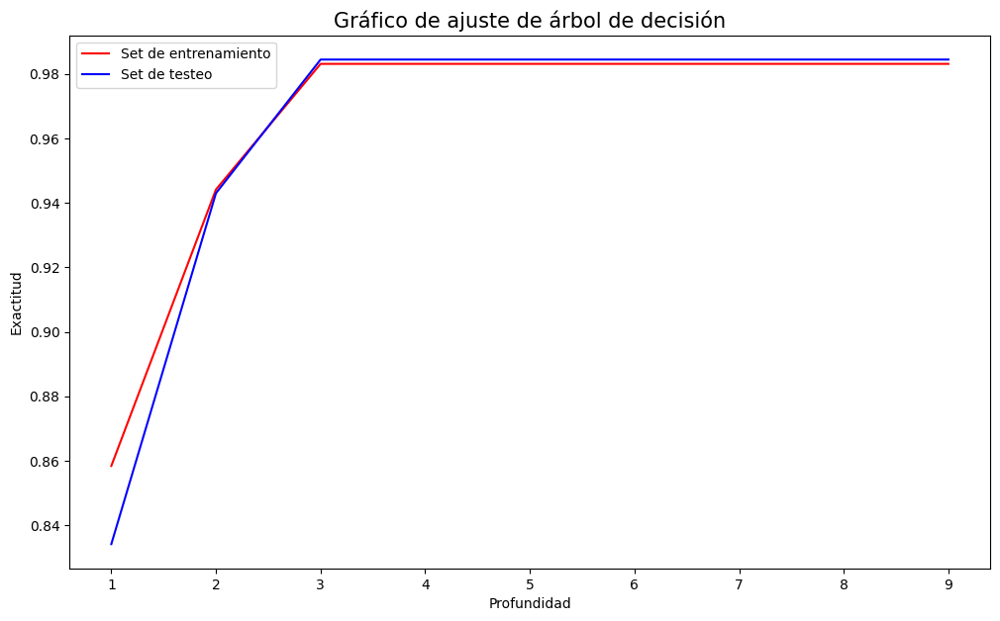

# **Proyecto Integrador**

# Análisis exploratorio de datos

Machine Learning en Medicina: Al aplicar Machine Learning en Medicina se pueden usar las herramientas informáticas, con el fin de conseguir información a partir de los datos, por ejemplo, de historias clínicas o registros de prestadores de servicios de salud. De esta manera, se pueden emitir diagnósticos predicitivos, evaluar la efectividad de estrategias de intervención y anticipar comportamientos en escenarios relacionados con la atención. 

# **Planteamiento de la problemática**

Hemos sido contratados en el equipo de ciencia de datos en una consultora de renombre. Nos han asignado a un proyecto de estudio de atención en salud para un importante hospital. **Nuestro cliente desea saber las características más importantes que tienen los pacientes de cierto tipo de enfermedad que terminan en hospitalización.** Fue definido como caso aquel paciente que fue sometido a biopsia prostática y que en un periodo máximo de 30 días posteriores al procedimiento presentó fiebre, infección urinaria o sepsis; requiriendo manejo médico ambulatorio u hospitalizado para la resolución de la complicación y como control al paciente que fue sometido a biopsia prostática y que no presentó complicaciones infecciosas en el período de 30 días posteriores al procedimiento. Dado que tienen en su base de datos algunos datos referentes a los pacientes y resultados de exámenes diagnósticos, de pacientes hospitalizados y no hospitalizados, nos han entregado esta información.  

Para ello, nuestro departamento de datos ha recopilado `Antecedentes del paciente`, `Morbilidad asociada al paciente` y `Antecedentes relacionados con la toma de la biopsia`y `Complicaciones infecciosas`. En la siguiente tabla, se encuentra un diccionario de datos asociado:

El departamente de datos advierte que hay algunos problemas de calidad de datos en la información suministrada por lo que el primer reto del equipo es realizar un análisis exploratorio de los datos con el fin de transformar y preparar las datos adecuadamente.

# **Interpretación de resultado y conclusiones**

A través del análisis realizado, en función a la problemática planteada, encontramos que aquellas características más influyentes en la hospitalización son las siguientes:

- FIEBRE
- ITU 
- SEPSIS, la cuál fue definida previamente por el equipo
  
  
# **Modelos**

En base a esto, realizamos pruebas con distintos modelos que no tuvieron un buen funcionamiento como KNeighborsClassifier y Scalable Linear Support Vector Machine.

  
Los mejores resultados obtenidos pertenecen al DecisionTreeClassifier. Se evaluaron los mejores párametros con el uso de distintas métricas, obteniendo la simulación de modelo que se presentaría a producción.
  
## **GridSearch**

Realizaremos una _`búsqueda exhaustiva`_ para encontrar los mejores hiperparámetros del modelo de clasificación. Utilizaremos la técnica de **_Grid Search Cross-Validation_**, que nos permitirá explorar diferentes combinaciones de hiperparámetros y evaluar su rendimiento mediante la validación cruzada. Nuestro objetivo es encontrar los valores óptimos para los hiperparámetros **`'max_depth', 'criterion'`**

## **Relación exactitud/profundidad**

Exactitud en base a la profundidad del árbol de decisión en el modelo

## **Matriz de confusión**

`Matriz de confusión con el set de testeo en KNeighborsClassifier`
  
